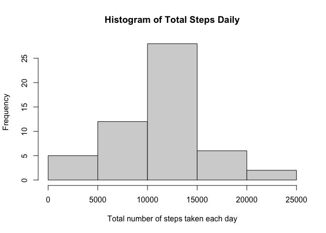
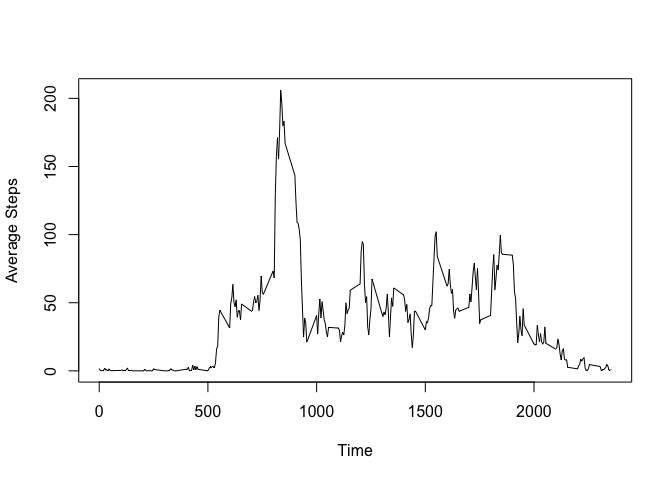
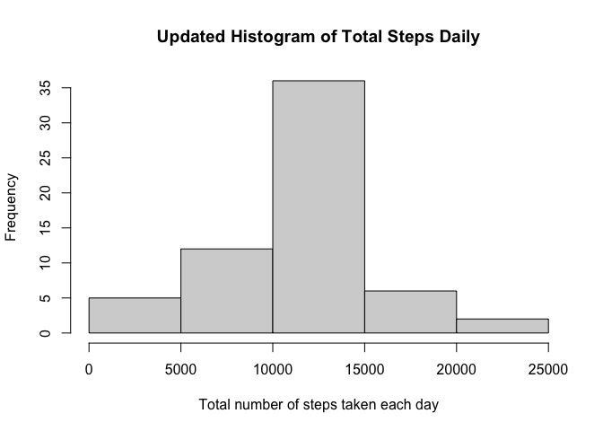
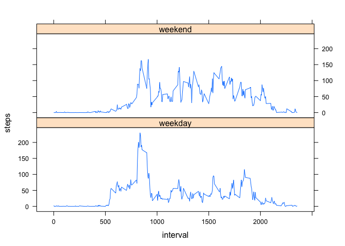

## Loading and preprocessing the data
1. Load the data (i.e. \color{red}{\verb|read.csv()|}read.csv())

```r
activity <- read.csv(file ="activity.csv",
                na.strings = "NA",
                stringsAsFactors = T)
```

2. Process/transform the data (if necessary) into a format suitable for your analysis

```r
activity$date <- as.Date(activity$date, "%Y-%m-%d")
head(activity)
```

```
##   steps       date interval
## 1    NA 2012-10-01        0
## 2    NA 2012-10-01        5
## 3    NA 2012-10-01       10
## 4    NA 2012-10-01       15
## 5    NA 2012-10-01       20
## 6    NA 2012-10-01       25
```

## What is mean total number of steps taken per day?
1. Calculate the total number of steps taken per day

```r
daily_total <- aggregate(steps~date, activity, sum)
print(daily_total)
```

```
##          date steps
## 1  2012-10-02   126
## 2  2012-10-03 11352
## 3  2012-10-04 12116
## 4  2012-10-05 13294
## 5  2012-10-06 15420
## 6  2012-10-07 11015
## 7  2012-10-09 12811
## 8  2012-10-10  9900
## 9  2012-10-11 10304
## 10 2012-10-12 17382
## 11 2012-10-13 12426
## 12 2012-10-14 15098
## 13 2012-10-15 10139
## 14 2012-10-16 15084
## 15 2012-10-17 13452
## 16 2012-10-18 10056
## 17 2012-10-19 11829
## 18 2012-10-20 10395
## 19 2012-10-21  8821
## 20 2012-10-22 13460
## 21 2012-10-23  8918
## 22 2012-10-24  8355
## 23 2012-10-25  2492
## 24 2012-10-26  6778
## 25 2012-10-27 10119
## 26 2012-10-28 11458
## 27 2012-10-29  5018
## 28 2012-10-30  9819
## 29 2012-10-31 15414
## 30 2012-11-02 10600
## 31 2012-11-03 10571
## 32 2012-11-05 10439
## 33 2012-11-06  8334
## 34 2012-11-07 12883
## 35 2012-11-08  3219
## 36 2012-11-11 12608
## 37 2012-11-12 10765
## 38 2012-11-13  7336
## 39 2012-11-15    41
## 40 2012-11-16  5441
## 41 2012-11-17 14339
## 42 2012-11-18 15110
## 43 2012-11-19  8841
## 44 2012-11-20  4472
## 45 2012-11-21 12787
## 46 2012-11-22 20427
## 47 2012-11-23 21194
## 48 2012-11-24 14478
## 49 2012-11-25 11834
## 50 2012-11-26 11162
## 51 2012-11-27 13646
## 52 2012-11-28 10183
## 53 2012-11-29  7047
```

2. Make a histogram of the total number of steps taken each day

```r
hist(daily_total$steps, 
     xlab = "Total number of steps taken each day",
     main = "Histogram of Total Steps Daily")
```

<!-- -->

3. Calculate and report the mean and median of the total number of steps taken per day

```r
mean_total_steps_daily <- mean(daily_total$steps)
median_total_steps_daily <- median(daily_total$steps)
```
**The mean and median of the total number of steps taken per day are 10766.19 and 10765 respectively.**

## What is the average daily activity pattern?
1. Make a time series plot (i.e. \color{red}{\verb|type = "l"|}type = "l") of the 5-minute interval (x-axis) and the average number of steps taken, averaged across all days (y-axis)

```r
pattern <- aggregate(steps~interval, activity, mean)
plot(pattern$interval,
     pattern$steps,
     type = "l",
     ylab = "Average Steps",
     xlab = "Time")
```

<!-- -->

2. Which 5-minute interval, on average across all the days in the dataset, contains the maximum number of steps?

```r
max_steps <- pattern$interval[which.max(pattern$steps)]
```
**On average across all the days in the dataset, 835 is the 5-minute interval that contains the maximum number of steps.**

## Imputing missing values
1. Calculate and report the total number of missing values in the dataset (i.e. the total number of rows with \color{red}{\verb|NA|}NAs)

```r
missing <- sum(is.na(activity))
```
The total number of missing values in the dataset is 2304.

2. Devise a strategy for filling in all of the missing values in the dataset. The strategy does not need to be sophisticated. For example, you could use the mean/median for that day, or the mean for that 5-minute interval, etc.
Strategy: use mean for that 5-min interval

3. Create a new dataset that is equal to the original dataset but with the missing data filled in.

```r
activity2 <- activity
for(i in 1:nrow(activity)){
        if(is.na(activity$steps[i])){
                activity2$steps[i] <- pattern$steps[pattern$interval == activity$interval[i]]
                
        }
}
head(activity2)
```

```
##       steps       date interval
## 1 1.7169811 2012-10-01        0
## 2 0.3396226 2012-10-01        5
## 3 0.1320755 2012-10-01       10
## 4 0.1509434 2012-10-01       15
## 5 0.0754717 2012-10-01       20
## 6 2.0943396 2012-10-01       25
```

4. Make a histogram of the total number of steps taken each day and Calculate and report the mean and median total number of steps taken per day. Do these values differ from the estimates from the first part of the assignment? What is the impact of imputing missing data on the estimates of the total daily number of steps?

```r
daily_total2 <- aggregate(steps~date, activity2, sum)
hist(daily_total2$steps, 
     xlab = "Total number of steps taken each day",
     main = "Updated Histogram of Total Steps Daily")
```

<!-- -->

```r
mean_total_steps_daily2 <- mean(daily_total2$steps)
median_total_steps_daily2 <- median(daily_total2$steps)

delta_mean <- mean_total_steps_daily2 - mean_total_steps_daily
delta_median <- median_total_steps_daily2 - median_total_steps_daily
```
The updated mean and median of the total number of steps taken per day are 10766.19 and 10766.19 respectively. The mean value did not change, however, the median changed by a value of 1.1886792


## Are there differences in activity patterns between weekdays and weekends?
For this part the \color{red}{\verb|weekdays()|}weekdays() function may be of some help here. Use the dataset with the filled-in missing values for this part.

1. Create a new factor variable in the dataset with two levels – “weekday” and “weekend” indicating whether a given date is a weekday or weekend day.

```r
activity2["type"] <- NA
for(j in 1:nrow(activity2)){
        if(weekdays(activity2$date[j]) == "Sunday"| weekdays(activity2$date[j]) == "Saturday"){
                activity2$type[j] <- "weekend"
        }
        else{
                activity2$type[j] <- "weekday"
        }
}
activity2$type <- as.factor(activity2$type)
head(activity2)
```

```
##       steps       date interval    type
## 1 1.7169811 2012-10-01        0 weekday
## 2 0.3396226 2012-10-01        5 weekday
## 3 0.1320755 2012-10-01       10 weekday
## 4 0.1509434 2012-10-01       15 weekday
## 5 0.0754717 2012-10-01       20 weekday
## 6 2.0943396 2012-10-01       25 weekday
```

2. Make a panel plot containing a time series plot (i.e. \color{red}{\verb|type = "l"|}type = "l") of the 5-minute interval (x-axis) and the average number of steps taken, averaged across all weekday days or weekend days (y-axis). See the README file in the GitHub repository to see an example of what this plot should look like using simulated data.


```r
pattern2 <- aggregate(steps~interval+type, activity2, mean)
xyplot(steps~interval|type,
       data = pattern2,
       type = "l",
       layout = c(1,2))
```

<!-- -->
